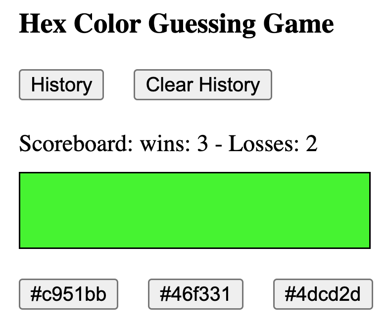
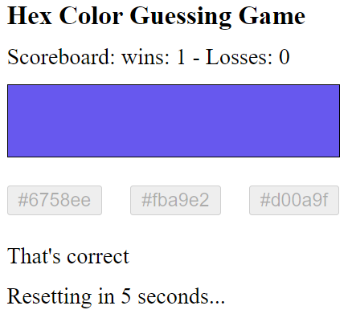
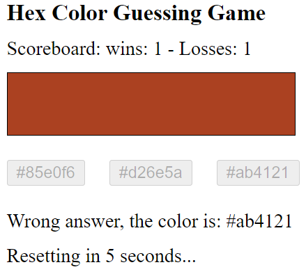
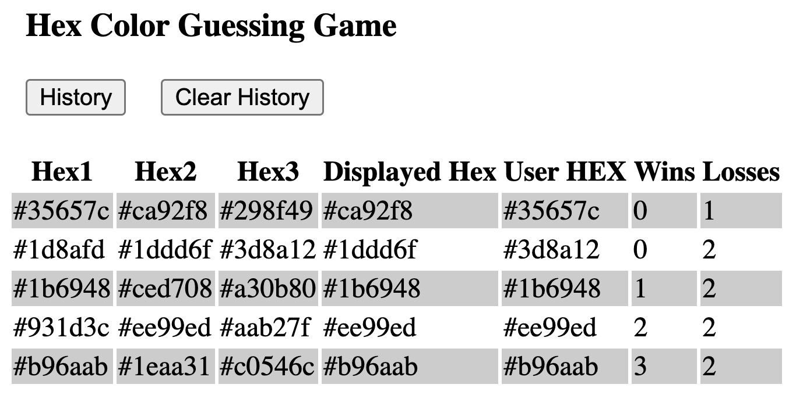

[](https://classroom.github.com/open-in-codespaces?assignment_repo_id=11276517)
# CS569-Hex Color Guessing Game
Welcome to the first workshop in the CS569 course. We are going to build a HEX color guessing game!  
  
This is an individual workshop and should not be worked in groups. Participating would give you an advantage, and not participating would not affect your standing in the course. The submission deadline is 12:30 PM, I would like to say `thank you` to all students who joined our June 1, afternoon online meeting on time, and students who had their cameras turned on after we finished meditation. Those who joined the meeting on time will have an additional 30 mins, and those  who had their camera turned on after meditation will also have additional 30 mins. (Those who did both will have additional 60 mins). My way to say `thank you`.
  
The advantage of participating and submitting a correct solution before your assigned deadline, including the additional requirements, is to receive **2 extra points added to your final exam grade.** If you pushed your code before your assigned deadline and completed all requirements, send me a message on Teams so I could check your code immediately and determine your eligibility for the 2 extra points, you should be able to answer any questions about your code.
  
We will meet online at 2:00 PM to review and go over the solution together. Good luck to everyone, and happy coding!  
  
## Game specifications
In this game users will have to guess the displayed color from 3 buttons as shown below:
<p align="center">
  
</p>
  
Once the user clicks on the answer:  
* All buttons are disabled.  
* A message is displayed with: "That's Correct!" Or "Wrong answer, the color is: #RRGGBB".   
* Change the scoreboard state.
* Display an interval countdown from 5 to 0 seconds and reset the game once it reaches 0 (Reset: generate three new HEX colors, pick one of them to be displayed, activate buttons, remove all messages) as displayed below:  
  
<p align="center">
  
  
</p>
  
## Additional requirements
1. Add cheating option: this allows users to double click the colored space and receive an alert with the displayed background color HEX code. Create a directive `CheatDirective`, that listens to its host element (color div) for double-click event, and displays the HEX color value as alert.
2. Persist the history of all game rounds in an array, along with the scoreboard results in the `localStorage` object and restore the scoreboard when the app reloads. Add a button to show and hide the game history, and another button to reset/clear the history.
  
  <p align="center">
  
</p>
  
## Code assistance
The two methods below generate a random HEX color value, and pick a random value from a given array:
```typescript
  private generateRandomHexColor(): string {
    return '#' + (Math.random() * 0xFFFFFF << 0).toString(16).padStart(6, '0');
  }
  
  private getRandomItemFromArray(arr: string[]): string {
    return arr[Math.floor(Math.random() * arr.length)];
  }
```
### Code Honor Submission Policy
*Remember to respect the code honor submission policy. All written code must be original. Presenting any code as one’s own work when it came from another source is plagiarism, that includes any matching patterns and code snippets, and will affect your grade. The use of AI is not permitted in this assigment. For more details, check the full course policies in the syllabus.*
